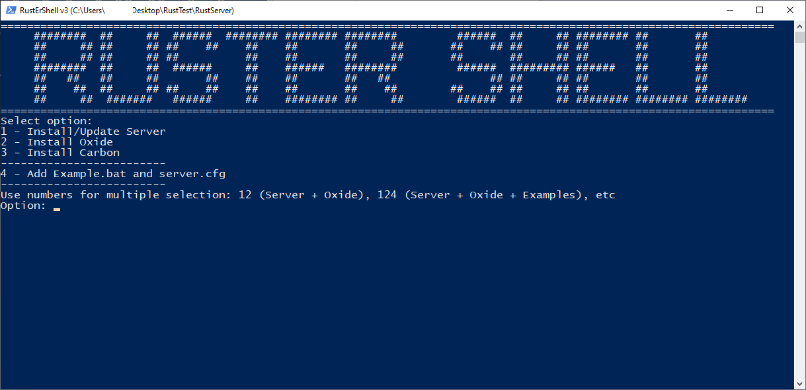

# Rust ER Shell

Powershell tool for updating Rust Experimental server and installing/updating addons (Oxide, Carbon, etc)

Features:
 * Stable (no external connections)
 * Compatible (built-in at Windows)
 * Direct downloads (Server from Steam, Oxide/Carbon from Github)

Download:
 * [Click Here](https://github.com/AngryDatchund/Rust-Er-Shell/blob/main/RustErShell.ps1)

Platforms:
 * Windows